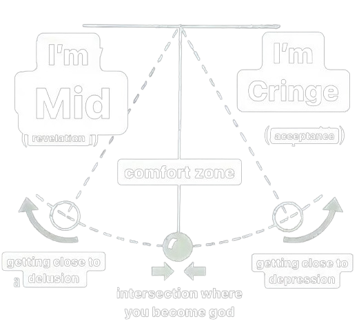

<h2 align="left">APf0x</h2>

    

Hi, i should start using my real name to actually build an image, oh well, this is my github page, no one looks at it, all i do is because of my love for creation, this is home to many projects, most are private because.

i  dont really use wakatime anymore its 3 years behind </a>

<h2><i>stats</i></h2>

