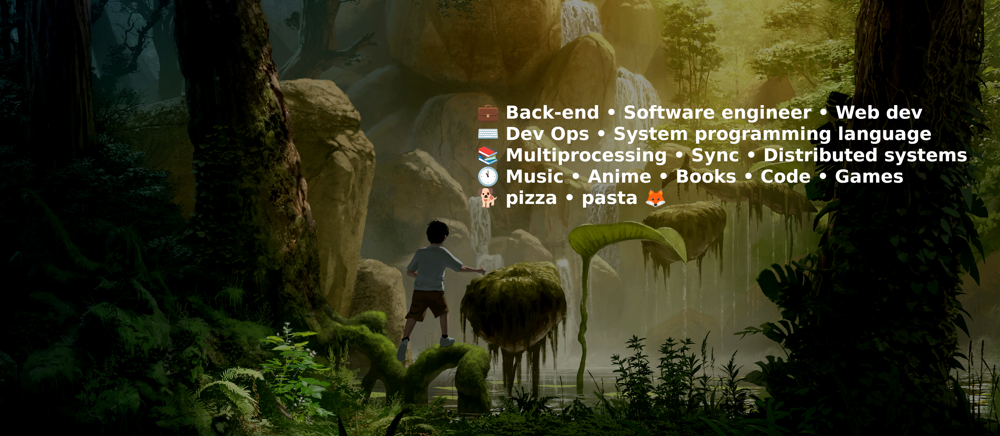

 

<h2 align="center"> 🦊<a href="https://resume.io/r/oPlPUJ5iB"> ~ 𝓐𝓫𝓸𝓾𝓽 𝓶𝓮 ~ </a>🦊 </h2>

Hi, this is fox. An coding student and programmer. I spend my free time working on various projects and studying. I'm currently learning various algorythms, pointers and much more. Feel free to contact me on my social media 😄😄😄.

       

 

 

<h2><i>🦊 ~ 𝓠𝓾𝓸𝓽𝓮 𝓸𝓯 𝓽𝓱𝓮 𝓭𝓪𝔂 ~ 🦊</i></h2>

<blockquote>The destiny of man is in his own soul. </blockquote>

  
<h2><i>🦊 ~ 𝓢𝓽𝓪𝓽𝓼 ~ 🦊</i></h2>

